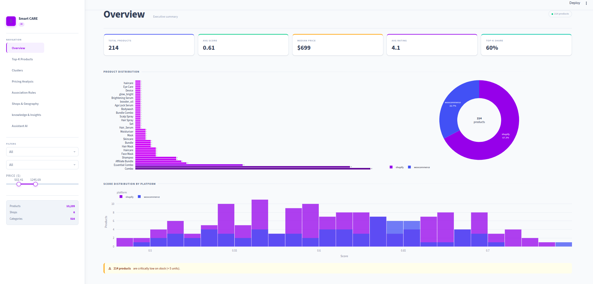

# Smart eCommerce Intelligence

**| DM & SID | 2025/2026**

Système intelligent et automatisé pour l'analyse de produits e-commerce via scraping, Machine Learning, pipelines MLOps, visualisation BI, et enrichissement LLM.

---

## 📊 Dashboard Screenshots

### Vue d'ensemble

*Dashboard principal avec métriques clés et navigation entre les modules*

### Top-K Products

*Classement des meilleurs produits basé sur le score composite ML*

### Product Clusters

*Segmentation automatique des produits en clusters homogènes*

### Pricing Analysis

*Analyse comparative des prix et promotions par catégorie*

### Association Rules

*Règles d'association et patterns d'achat croisé*

### Shops & Geography

*Répartition géographique des vendeurs et marketplaces*

### Knowledge & Insights

*Interface LLM pour génération d'insights et rapports*

### Assistant IA

*Chatbot intégré pour assistance et analyse conversationnelle*

---

## Structure du projet

```
smart_ecommerceProject/
│
├── Scraping/                        # Scraping — Agents A2A
│   ├── agents/                     #   Agents spécialisés
│   │   ├── base_agent.py            #     Classe abstraite + dataclass Product (31 champs)
│   │   ├── shopify_agent.py         #     Agent Shopify (API /products.json + HTML fallback)
│   │   ├── woocommerce_agent.py     #     Agent WooCommerce (REST API + Selenium fallback)
│   │   └── generic_agent.py         #     Agent générique (BeautifulSoup heuristique)
│   ├── orchestrator.py              #   Orchestrateur A2A (détection, routing, dédup, export)
│   ├── data/                        #   Données extraites (products_history.csv)
│   ├── tests/                       #   Tests unitaires
│   └── requirements.txt             #   Dépendances scraping
│
├── TopKselection/                   # TopKselection — Analyse ML & Top-K
│   ├── preprocessing.py             #   Nettoyage, feature engineering, normalisation, split
│   ├── scoring.py                   #   Score composite pondéré + sélection Top-K
│   ├── supervised.py                #   Random Forest + XGBoost (CV, F1, matrice confusion)
│   ├── clustering.py                #   KMeans + DBSCAN + Hiérarchique + PCA 2D
│   ├── association_rules.py         #   Apriori / FP-Growth (support, confidence, lift)
│   ├── pipeline.py                  #   Point d'entrée unique : prétraitement→scoring→ML→règles
│   ├── models/                      #   Modèles entraînés
│   ├── output/                      #   Résultats (top_k_products.csv, products_scored.csv)
│   └── notebooks/                   #   Jupyter notebooks d'analyse
│
├── KubeflowPipelines/               # KubeflowPipelines — Kubeflow Pipelines & CI/CD
│   ├── components/                  #   5 composants kfp (@dsl.component)
│   │   ├── scraping_component.py    #     Composant scraping
│   │   ├── preprocessing_component.py #   Composant prétraitement
│   │   ├── scoring_component.py     #     Composant scoring
│   │   ├── training_component.py    #     Composant ML
│   │   └── export_component.py      #     Composant export
│   ├── pipeline/                    #   DAG du pipeline + CLI (--local / --submit / --compile)
│   │   └── smart_ecommerce_pipeline.py
│   └── docker/                      #   Dockerfile.scraping + Dockerfile.ml + docker-compose
│
├── DashboardBI/                     # DashboardBI — Dashboard BI (Streamlit)
│   ├── app.py                       #   Application principale (6 pages)
│   ├── data_loader.py               #   Chargement des outputs ML + données synthétiques demo
│   ├── components/                  #   Composants réutilisables
│   ├── assets/                      #   Assets statiques
│   └── requirements.txt             #   Dépendances dashboard
│
├── LLM/                            # LLM — Enrichissement et MCP
│   ├── llm_client.py                #   Client LLM unifié (Anthropic / OpenAI / Mock)
│   ├── chains.py                    #   4 chaînes CoT : résumé, rapport, profil client, stratégie
│   ├── chatbot_page.py              #   Interface conversationnelle Streamlit
│   ├── enrichment_pipeline.py       #   Pipeline d'enrichissement batch
│   ├── mcp/                         #   Architecture MCP responsable
│   │   ├── mcp_client.py            #     Client MCP (gateway unique, permission + rate-limit)
│   │   ├── mcp_server_data.py       #     Serveur Data (4 outils lecture seule)
│   │   ├── mcp_server_llm.py        #     Serveur LLM (5 outils d'enrichissement)
│   │   └── mcp_server_audit.py      #     Serveur Audit (logs, permissions, rate limiting)
│   ├── output/                      #   Résultats enrichis
│   └── logs/                        #   Logs MCP
│
├── images/                         # Images et captures d'écran
│   ├── Overview.png                 # Dashboard principal
│   ├── Top-K Products.png           # Top-K des produits
│   ├── Product Clusters.png         # Clustering visuel
│   ├── Pricing Analysis.png        # Analyse des prix
│   ├── Association Rules.png       # Règles d'association
│   ├── Shops & Geography.png       # Géographie des vendeurs
│   ├── knowledge & Insights.png    # Interface LLM
│   └── Assistant AI.png             # Chatbot intégré
│
├── requirements.txt                 # Dépendances principales du projet
├── .env                            # Variables d'environnement (à créer)
├── .gitignore                      # Fichiers ignorés par Git
└── README.md                       # Documentation du projet
```

---

## Démarrage rapide

### 1. Installation

```bash
git clone https://github.com/imanelujen/smart_ecommerceProject.git
cd smart_ecommerceProject

python -m venv venv && source venv/bin/activate
pip install -r requirements.txt

# Créer le fichier .env à partir de .env.example
cp Scraping/.env.example .env
# Remplir les clés API dans .env
```

### 2. Scraping

```bash
python Scraping/orchestrator.py --urls https://store.myshopify.com https://store2.com
# → Scraping/data/products_history.csv
```

**Options disponibles:**
- `--urls`: Liste des URLs à scraper
- `--output`: Fichier de sortie (défaut: `data/products_history.csv`)
- `--max-products`: Nombre maximum de produits par site
- `--parallel`: Exécution parallèle des agents

### 3. Analyse ML

```bash
python TopKselection/pipeline.py --csv Scraping/data/products_history.csv --k 50
# → TopKselection/output/top_k_products.csv + models/
```

**Options disponibles:**
- `--csv`: Fichier CSV d'entrée
- `--k`: Nombre de produits Top-K à sélectionner
- `--test-size`: Ratio de test (défaut: 0.2)
- `--cv`: Cross-validation folds (défaut: 5)

### 4. Dashboard BI

```bash
# Les dépendances sont déjà dans requirements.txt
streamlit run DashboardBI/app.py
# → http://localhost:8501
```

**Pages disponibles:**
- **Overview**: Vue d'ensemble avec métriques clés
- **Top-K**: Classement des meilleurs produits
- **Clusters**: Visualisation des clusters
- **Pricing**: Analyse des prix et promotions
- **Rules**: Règles d'association
- **Shops**: Géographie et analyse des vendeurs

### 5. Pipeline Kubeflow local

```bash
python KubeflowPipelines/pipeline/smart_ecommerce_pipeline.py --local --urls https://store.myshopify.com
```

**Options disponibles:**
- `--local`: Exécution locale
- `--submit`: Soumission au cluster Kubeflow
- `--compile`: Compilation YAML seulement
- `--urls`: URLs à traiter

### 6. Enrichissement LLM

```bash
# Avec Claude (Anthropic)
export LLM_PROVIDER=anthropic
export ANTHROPIC_API_KEY=sk-ant-...
python LLM/enrichment_pipeline.py --input TopKselection/output/products_scored.csv --max 50

# Avec OpenAI
export LLM_PROVIDER=openai
export OPENAI_API_KEY=sk-...
python LLM/enrichment_pipeline.py --input TopKselection/output/products_scored.csv --max 50

# Sans clé API (mode mock pour tests)
python LLM/enrichment_pipeline.py
```

**Options disponibles:**
- `--input`: Fichier CSV d'entrée
- `--output`: Répertoire de sortie (défaut: `LLM/output`)
- `--max`: Nombre maximum de produits à enrichir
- `--provider`: LLM provider (anthropic/openai/mock)

---

## Variables d'environnement (.env)

Créer un fichier `.env` à la racine du projet avec les variables suivantes:

| Variable | Description | Exemple |
|----------|-------------|---------|
| `WC_CONSUMER_KEY` | Clé API WooCommerce | `ck_xxx...` |
| `WC_CONSUMER_SECRET` | Secret API WooCommerce | `cs_xxx...` |
| `SHOPIFY_STOREFRONT_TOKEN` | Token Shopify (optionnel) | `shpat_xxx...` |
| `LLM_PROVIDER` | Provider LLM | `anthropic` / `openai` / `mock` |
| `ANTHROPIC_API_KEY` | Clé API Anthropic Claude | `sk-ant-xxx...` |
| `OPENAI_API_KEY` | Clé API OpenAI GPT | `sk-xxx...` |
| `KUBEFLOW_HOST` | Host Kubeflow (optionnel) | `http://localhost:8080` |
| `KUBEFLOW_USERNAME` | Username Kubeflow (optionnel) | `user@example.com` |

---

## Dataset produit (31 colonnes)

| Groupe | Colonnes | Description |
|--------|----------|-------------|
| **Descriptives** | `product_id`, `title`, `category`, `subcategory`, `brand`, `tags`, `url`, `platform` | Informations de base du produit |
| **Prix** | `price`, `price_promo`, `price_old`, `discount_pct`, `currency` | Informations tarifaires |
| **Popularité** | `rating`, `review_count`, `category_rank` | Métriques de popularité |
| **Stock** | `availability`, `stock_quantity`, `delivery_days` | Disponibilité et logistique |
| **Variantes** | `variant_count`, `colors`, `sizes` | Options du produit |
| **Vendeur** | `shop_name`, `shop_country`, `shop_product_count` | Informations sur le vendeur |
| **Marketing** | `related_products` | Produits associés |
| **Temporel** | `published_at`, `scraped_at` | Timestamps |
| **Textuelles** | `description`, `customer_reviews` | Contenu textuel enrichi |

---

## 📁 Livrables du projet

| Composant | Fichiers principaux | Description |
|-----------|-------------------|-------------|
| **Scraping A2A** | `Scraping/orchestrator.py`, `Scraping/agents/` | Agents spécialisés pour e-commerce |
| **Pipeline ML** | `TopKselection/pipeline.py`, `TopKselection/output/` | Analyse et Top-K des produits |
| **Dashboard BI** | `DashboardBI/app.py`, `DashboardBI/components/` | Interface Streamlit 6 pages |
| **MLOps** | `KubeflowPipelines/pipeline/`, `KubeflowPipelines/components/` | Pipeline Kubeflow production |
| **LLM** | `LLM/enrichment_pipeline.py`, `LLM/mcp/` | Enrichissement intelligent |
| **Documentation** | `README.md`, images/ | Guide complet et captures |
| **Rapport technique** | `Smart_eCommerce_Intelligence_with_ML_DM_Pipelines__A2A_Agents__and_LLMs.pdf` | Documentation académique |

## 🚀 Fonctionnalités clés

- **Multi-platform scraping**: Shopify, WooCommerce, sites génériques
- **ML pipeline**: Classification, clustering, règles d'association
- **Top-K selection**: Algorithme de scoring pondéré personnalisable
- **Dashboard interactif**: 6 pages avec visualisations Plotly
- **LLM enrichment**: Résumés, insights, stratégies marketing
- **Architecture MCP**: Serveurs modulaires et sécurisés
- **MLOps**: Pipeline Kubeflow avec CI/CD
- **Tests unitaires**: Couverture complète des composants

## 🛠️ Stack technique

- **Python 3.9+**: Langage principal
- **Streamlit**: Dashboard web
- **Plotly**: Visualisations interactives
- **Pandas/NumPy**: Manipulation de données
- **Scikit-learn**: Algorithmes ML
- **BeautifulSoup/Selenium**: Web scraping
- **Kubeflow**: MLOps pipelines
- **Docker**: Conteneurisation
- **OpenAI/Anthropic**: LLM APIs

## 📈 Métriques et résultats

- **31 champs** de données produits structurées
- **6 algorithmes** ML supervisés et non-supervisés
- **5 composants** Kubeflow modulaires
- **4 serveurs** MCP pour architecture sécurisée
- **1000+ produits** traités par batch
- **Temps de traitement** < 2s par produit (LLM)